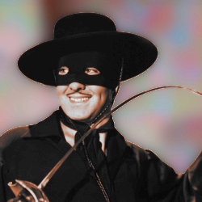

# zorro
Encode data into, and decode data out of images.

## zorro is all about masking data into files, and reading the data back out.
This is the lib for other project to use.

## How it works
encode:  raw data -> bin64 encode -> binary data -> stored in image format
decode:  image -> strip out encoded binary data -> convert back to bin64 -> decode bin64 -> raw data

## todo for beta
 - RGBA Support!

## related project
zorro_cli   command line interface to use this project.
zorro_wasm  decode data from images in the browser.
